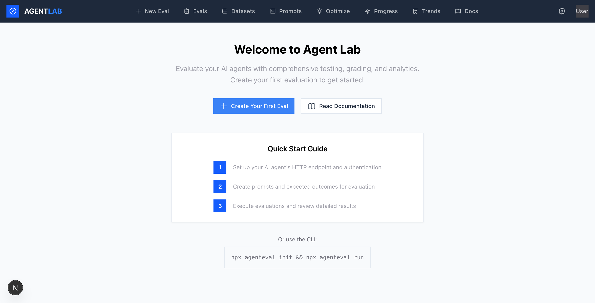
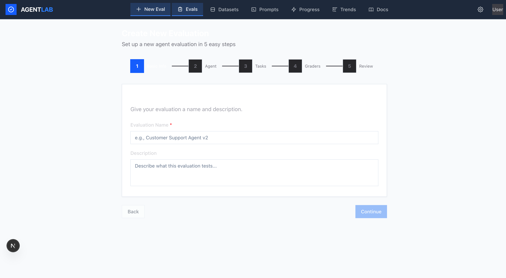
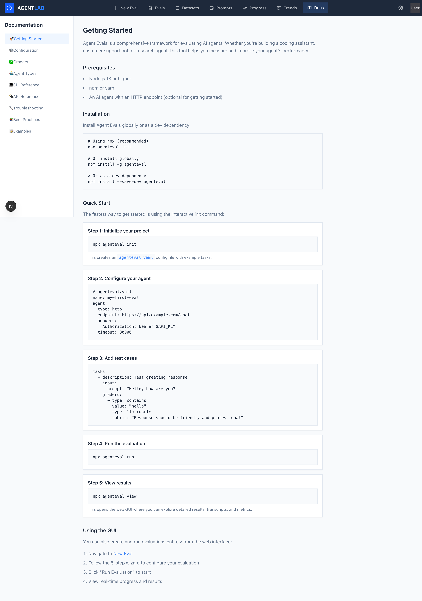
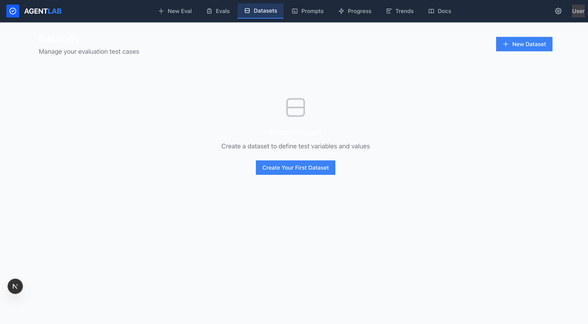

<p align="center">
  
</p>

<h1 align="center">Agent Lab</h1>

<p align="center">
  <strong>A comprehensive evaluation framework for AI agents</strong>
</p>

<p align="center">
  <a href="#features">Features</a> •
  <a href="#quick-start">Quick Start</a> •
  <a href="#installation">Installation</a> •
  <a href="#usage">Usage</a> •
  <a href="#graders">Graders</a> •
  <a href="#configuration">Configuration</a> •
  <a href="#contributing">Contributing</a>
</p>

<p align="center">
  
  
  
</p>

---

Agent Lab is a production-grade evaluation framework for testing AI agents. Whether you're building coding assistants, customer support bots, research agents, or computer-use agents, Agent Lab helps you systematically measure and improve your agent's performance.

Inspired by tools like [promptfoo](https://github.com/promptfoo/promptfoo) and [DSPy](https://github.com/stanfordnlp/dspy), but purpose-built for agent evaluation with comprehensive grading, transcript capture, and analytics.

## Features

- **Multiple Grader Types** - String matching, JSON validation, regex, LLM-based rubrics, factuality checking, semantic similarity, and human review queues
- **Agent-Specific Evaluators** - Specialized evaluation for coding agents (test pass rates), conversational agents (user simulation), research agents (groundedness), and computer-use agents (visual diff)
- **Trial Management** - Run multiple attempts per task with pass@k and pass^k statistics
- **Full Transcript Capture** - Record all messages, tool calls, timestamps, and token counts
- **Web GUI & CLI** - Both visual interface and command-line tools for flexibility
- **Real-time Progress** - Live updates via WebSocket during evaluation runs
- **Metrics & Analytics** - Pass rates, latency percentiles (p50/p95/p99), token usage, and cost estimation
- **Dataset Management** - Import test cases from CSV/JSON with variable substitution
- **Prompt Templates** - Version-controlled prompt management

## Screenshots

<details>
<summary>View Screenshots</summary>

### Evaluation Wizard


### Documentation


### Dataset Management


</details>

## Quick Start

The fastest way to get started is with the Web GUI:

```bash
# Clone and install
git clone https://github.com/yourusername/agent-lab.git
cd agent-lab
npm install

# Set up the database
npm run db:generate
npm run db:migrate

# Start the web interface
npm run dev
```

Open `http://localhost:3000` and click **Create Your First Eval**. The wizard walks you through everything.

## Installation

### Prerequisites

- Node.js 18 or higher
- npm, yarn, or pnpm

### From Source (Recommended)

```bash
# Clone the repository
git clone https://github.com/yourusername/agent-lab.git
cd agent-lab

# Install dependencies
npm install

# Set up the database
npm run db:generate
npm run db:migrate

# Start the development server
npm run dev
```

## Usage

### Web GUI (Recommended)

The web interface provides:

- **Dashboard** - Overview of recent evaluations with stats and charts
- **Eval Wizard** - 5-step guided setup for new evaluations
- **Results Viewer** - Detailed task/trial matrix with expandable transcripts
- **Datasets** - Manage reusable test case collections
- **Prompts** - Version-controlled prompt templates
- **Real-time Progress** - Live evaluation monitoring

Start the GUI:

```bash
npm run dev
# Then open http://localhost:3000
```

### CLI (Experimental)

> **Note:** The CLI is experimental and works only when running from the source repository. Some graders have placeholder implementations. Use the Web GUI for the best experience.

```bash
# Initialize a new evaluation config (creates agenteval.yaml)
npm run agenteval -- init

# Run an evaluation
npm run agenteval -- run

# Run with specific config file
npm run agenteval -- run --config my-eval.yaml

# Run with increased concurrency
npm run agenteval -- run --concurrency 5
```

## Configuration

Create an `agenteval.yaml` file:

```yaml
name: my-agent-eval
description: Evaluation for my AI agent

agent:
  type: http
  endpoint: https://api.example.com/chat
  headers:
    Authorization: Bearer ${API_KEY}
  timeout: 30000

tasks:
  - description: Test greeting response
    input:
      prompt: "Hello, how are you?"
    graders:
      - type: contains
        value: "hello"
      - type: llm-rubric
        rubric: "Response should be friendly and professional"

  - description: Test math calculation
    input:
      prompt: "What is 2 + 2?"
    graders:
      - type: exact
        value: "4"
      - type: contains
        value: "4"

settings:
  trials: 3
  concurrency: 2
```

### Environment Variables

Create a `.env` file (see `.env.example`):

```bash
# LLM API Keys (for model-based graders)
OPENAI_API_KEY=sk-...
ANTHROPIC_API_KEY=sk-ant-...

# Your agent's API key
API_KEY=your-agent-api-key
```

## Graders

Agent Lab supports 12+ grader types:

### Code-Based Graders

| Grader | Description |
|--------|-------------|
| `exact` | Exact string match |
| `contains` | Substring match |
| `regex` | Regular expression pattern |
| `json-match` | JSON structure validation |
| `json-schema` | JSON Schema validation |
| `state-check` | Database/file/API state verification |
| `test-runner` | Execute test suites (npm test, pytest, etc.) |

### Model-Based Graders

| Grader | Description |
|--------|-------------|
| `llm-rubric` | LLM evaluates against a rubric |
| `factuality` | Check factual accuracy against source |
| `similarity` | Semantic similarity via embeddings |

### Human Review

| Grader | Description |
|--------|-------------|
| `human` | Queue for manual review with scoring |

### Example Grader Configs

```yaml
graders:
  # Simple string matching
  - type: contains
    value: "success"
    case_sensitive: false

  # Regex pattern
  - type: regex
    pattern: "\\d{3}-\\d{4}"

  # LLM-based evaluation
  - type: llm-rubric
    rubric: |
      Score the response on:
      1. Accuracy (0-5)
      2. Helpfulness (0-5)
      3. Tone (0-5)
    model: gpt-4

  # JSON validation
  - type: json-schema
    schema:
      type: object
      required: ["status", "data"]
      properties:
        status: { type: string }
        data: { type: array }
```

## Agent Types

Specialized evaluators for different agent categories:

### Coding Agent
```yaml
agent:
  type: coding
  # Evaluates: test pass rates, static analysis, code quality
```

### Conversational Agent
```yaml
agent:
  type: conversational
  # Evaluates: user simulation, turn limits, tone analysis
```

### Research Agent
```yaml
agent:
  type: research
  # Evaluates: groundedness, coverage, source quality
```

### Computer Use Agent
```yaml
agent:
  type: computer-use
  # Evaluates: visual diffs, DOM state verification
```

## API Reference

### REST API Endpoints

```
GET    /api/evals          - List all evaluations
POST   /api/evals          - Create new evaluation
GET    /api/evals/:id      - Get evaluation details
DELETE /api/evals/:id      - Delete evaluation

GET    /api/datasets       - List datasets
POST   /api/datasets       - Create dataset
GET    /api/datasets/:id   - Get dataset
PUT    /api/datasets/:id   - Update dataset
DELETE /api/datasets/:id   - Delete dataset

GET    /api/prompts        - List prompt templates
POST   /api/prompts        - Create prompt template
```

## Project Structure

```
agent-lab/
├── src/                    # Next.js web application
│   ├── app/               # App router pages & API routes
│   └── components/        # React components
├── agent-evals/           # Core evaluation framework
│   └── src/
│       ├── core/          # Evaluator, task runner, metrics
│       ├── graders/       # All grader implementations
│       ├── providers/     # Agent providers (HTTP, CLI)
│       ├── agent-types/   # Specialized agent evaluators
│       ├── cli/           # CLI commands
│       └── db/            # Database schema (Drizzle ORM)
└── docs/                  # Documentation & screenshots
```

## Tech Stack

- **Framework**: Next.js 16 with App Router
- **Database**: SQLite with Drizzle ORM
- **UI**: React 19, Tailwind CSS, Recharts
- **CLI**: Commander.js
- **Real-time**: Socket.io
- **LLM SDKs**: Anthropic, OpenAI
- **Testing**: Vitest, Playwright

## Development

```bash
# Run development server
npm run dev

# Run tests
npm test

# Run tests with coverage
npm run test:coverage

# Run E2E tests
npm run test:e2e

# Generate database migrations
npm run db:generate

# Apply migrations
npm run db:migrate

# Open Drizzle Studio (database GUI)
npm run db:studio

# Lint code
npm run lint
```

## Contributing

Contributions are welcome! Please read our contributing guidelines before submitting PRs.

1. Fork the repository
2. Create a feature branch (`git checkout -b feature/amazing-feature`)
3. Commit your changes (`git commit -m 'Add amazing feature'`)
4. Push to the branch (`git push origin feature/amazing-feature`)
5. Open a Pull Request

### Development Guidelines

- Write tests for new features
- Follow existing code style
- Update documentation as needed
- Keep commits focused and descriptive

## Roadmap

- [ ] SDK providers (direct integration with agent frameworks)
- [ ] Prompt optimization engine (DSPy-inspired)
- [ ] Baseline tracking and regression detection
- [ ] Export/import evaluation configs
- [ ] Team collaboration features
- [ ] CI/CD integration examples

## License

MIT License - see [LICENSE](LICENSE) for details.

## Acknowledgments

- Inspired by [promptfoo](https://github.com/promptfoo/promptfoo) for LLM evaluation
- Inspired by [DSPy](https://github.com/stanfordnlp/dspy) for prompt optimization concepts
- Built with [Next.js](https://nextjs.org/), [Drizzle ORM](https://orm.drizzle.team/), and [Tailwind CSS](https://tailwindcss.com/)

---

<p align="center">
  Made with care for the AI agent community
</p>
